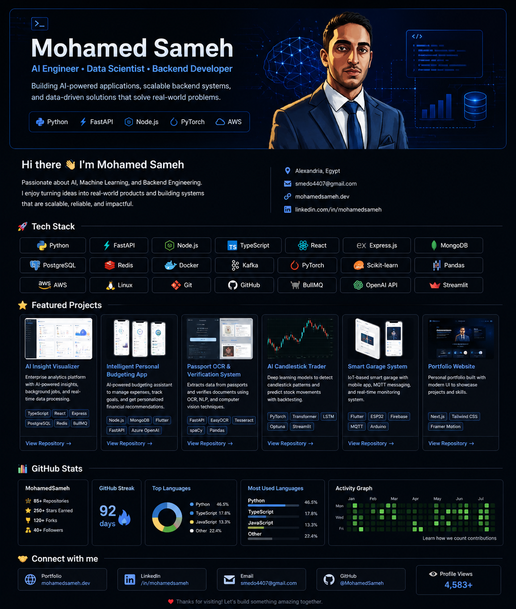

  

<h1 align="center">Hi 👋, I'm Mohamed Sameh</h1>

<h3 align="center">
AI Engineer • Data Scientist • Backend Developer
</h3>

---

<h2 align="center">👨‍💻 About Me</h2>

I'm **Mohamed Sameh**, an AI Engineer and Backend Developer passionate about building intelligent software that combines Artificial Intelligence, Machine Learning, and scalable backend engineering to solve real-world problems.

I enjoy transforming ideas into production-ready applications, whether it's AI-powered platforms, REST APIs, computer vision systems, or enterprise backend architectures.

- 🎓 **B.Sc. in Computer & Data Science**
- 🤖 Passionate about **Artificial Intelligence, Machine Learning, LLMs, Computer Vision, and Data Science**
- ⚙️ Experienced in **Backend Development, REST APIs, Microservices, and Cloud-ready Applications**
- 🚀 Built intelligent systems including AI analytics platforms, OCR solutions, financial applications, and deep learning models
- 🌱 Currently learning **AWS, Kubernetes, MLOps, Data Engineering, and Enterprise AI**
- 💼 Open to **AI Engineer • Machine Learning Engineer • Backend Engineer • Data Engineer** opportunities

---

<h2 align="center">🎯 Current Focus</h2>

- 🤖 Building AI-powered applications with **LLMs** and **Generative AI**
- ⚙️ Designing scalable backend architectures using **FastAPI** and **Node.js**
- ☁️ Expanding expertise in **AWS**, **Docker**, **Kubernetes**, and **MLOps**
- 📊 Exploring **Data Engineering** and **Enterprise AI Systems**

---

<h2 align="center">🛠️ Tech Stack</h2>

### 💻 Languages

### ⚙️ Backend

### 🎨 Frontend

### 🤖 AI & Machine Learning

Machine Learning • Deep Learning • OpenCV • EasyOCR • Tesseract • spaCy • scikit-learn • Pandas • NumPy

### 🗄️ Databases

### ☁️ Cloud & DevOps

### 🛠️ Tools

Power BI • Tableau • Kafka • Git • Linux

---

<h2 align="center">📊 GitHub Analytics</h2>

---

<h2 align="center">🚀 Featured Projects</h2>

### 🤖 AI Insight Visualizer

Enterprise AI analytics platform built with React, TypeScript, Express, PostgreSQL, BullMQ, and Redis.

🔗 https://github.com/medo-salah/AI-Insight-Visualizer

---

### 💰 Intelligent Personal Budgeting App

AI-powered budgeting platform featuring analytics, OCR, personalized recommendations, and intelligent expense tracking.

🔗 https://github.com/medo-salah

---

### 🛂 Passport OCR & Document Verification

OCR and document intelligence system built using FastAPI, EasyOCR, Tesseract, and spaCy.

🔗 https://github.com/medo-salah/passport_ocr

---

### 📈 AI Candlestick Trading

Deep learning application using Transformers, LSTM, PyTorch, and Optuna for financial prediction.

🔗 https://github.com/medo-salah/ai-candlestick-trader

---

<h2 align="center">📜 Certifications</h2>

| Certification | Organization |
|--------------|--------------|
| Understanding Data Science | DataCamp |
| Software Engineering Level 1 | Orange Digital Center |
| AI Courses | DeepLearning.AI |
| Data Science Internship | Konecta |

---

<h2 align="center">🌐 Let's Connect</h2>

---

⭐ Thanks for visiting my profile! ⭐
  
I enjoy building intelligent software, contributing to open-source projects, and continuously learning new technologies.
  
If you find my work interesting, feel free to connect with me or explore my repositories.

